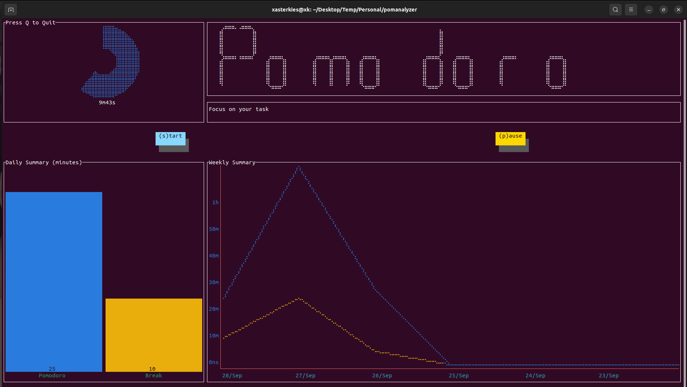

# 🍎📈 pomanalyzer
> A CLI that tracks your study time and analyze historical data of it with interactive charts in your terminal using the [pomodoro](https://en.wikipedia.org/wiki/Pomodoro_Technique) technique.




## Why?

I have always used the pomodoro technique to track the way I study and focus on my current tasks. I have been keeping track of this with a pomodoro mobile app that I use for my study sessions but over time I always get distracted because of notifications on my device. Thats when I had the idea what if I could do all that without using my phone. I started searching for alternatives and all I saw were browser extensions but I wanted something that will be rid of all distractions, so i started building this tool that works only in the terminal... an undistractable space.


## Tech Stack
Go, TermDash, Cobra, SQLite

## Features
- Start, Pause & Stop Pomodoro study sessions.
- Visualize summary of total amount study & break time in the CLI on a daily basis in Bar charts.
- Visualize summary of your weekly study trend with Line charts.

## How it works
Each study session counts for `25 minutes`. After a study session you get a short break for `5 minutes`. After a total of 4 study sessions you get a long break of `15 minutes`, after which you can restart a study session. All your study data is stored in an SQLite Database.


## Prerequisites
- Go (Golang)
  - Install using this tutorial for [linux/mac](https://golang.org/doc/install) and [windows](https://golang.org/doc/install#windows)

- SQLite
  - Install using this [tutorial](https://www.sqlite.org/download.html)

## Setting up the Project

1. Fork repository

2. Clone the forked repository in prefered directory

   ```bash
   git clone <project-url>
   ```

3. Enter project directory
  
   ```bash
   cd pomanalyzer
   ```

## Running the project

1. Install dependencies

    ```bash
    go get ./...
    ```

2. Clear Database
  - Make the script executable by running chmod if you are running Linux or MacOS

    ```bash
    chmod +x clear_db.sh
    ```
    
  - Run the script with
  
    ```bash
     ./clear_db.sh
    ```

3. Start the project (in root of the project folder)

   ```bash
   go build
   ```

4. Run CLI build

   ```bash
   ./pomanalyzer
   ```

## Future works
- [ ] Integrate a light weight notification library like ([notif](https://github.com/xasterKies/notif)) for audio notification for each study session.
- [ ] Cross-build and cross-compilation of application on various platforms.
- [ ] Building and distributing the application with a Docker.

## Contributing
if you have any issues running it or will like to make a contribute/suggest anything to the project, will be happy to hear from you in issues or PRs section :)

If you find a typo please help me fix it... Thanks!
